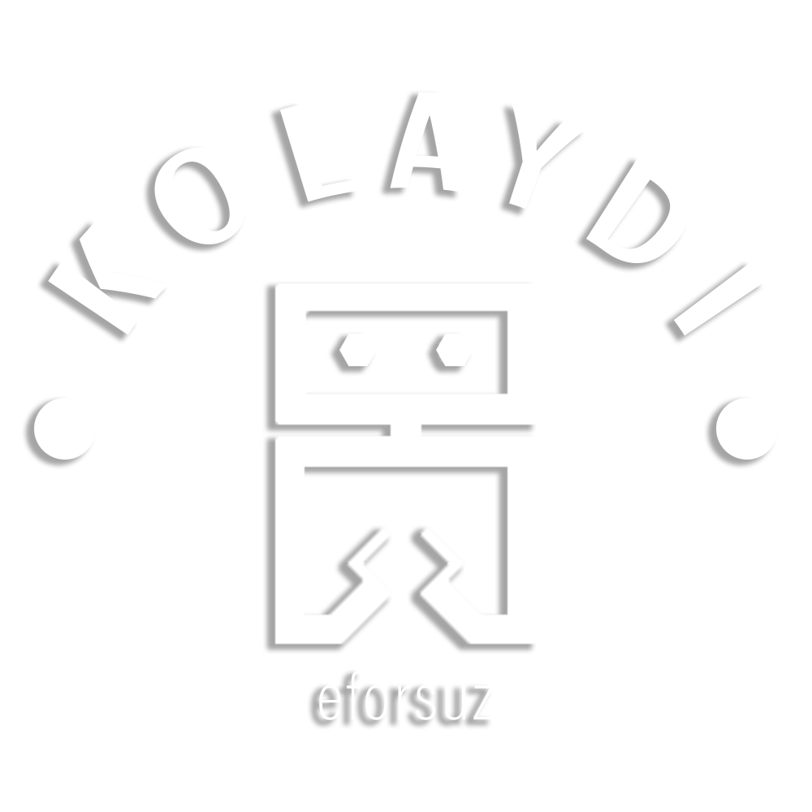

# Unamenned Ground Vehicle by Kolaydi Team
This project developed by Kolaydi Team for METU EEE Capstone project fair. The aim of the project is developing an UGV that is capable of 3D mapping, and autonomous navigation by a very cheap robot.
### Content
 - Team
 - Project Overview
 - Getting Started
 

### Team

Kolaydi consists of 5 Electrical-Electronics Engineering Students from different backgrounds :
- M. Taha Bekar
- Enfal Cabuk
- Yunus T. Erzurumlu
- Burcu Şakır
- Duru Uyar

### Project Overview

### Getting Started

### Installation

- open a folder named git
- clone the repository inside the git
- open terminal
- cd kolaydı
- catkin build or catkin_make
- source devel/setup.bash
You are ready to go!
- open couple of terminals inside de kolaydı
- source devel/setup.bash for all the terminals
- roslaunch ugv_sim ugv_gazebo.launch
This opens the gazebo

- rviz
This opens the visualization tool. There is a config file named ugv_rviz.rviz. Open this config from the "file" tab.
There might be some errors dont wory now.

- python3 src/ugv_sim/controllers/another_controller.py 
- python3 src/ugv_sim/scripts/laser2pcl.py

to make lidar to rotate for 3D
- rqt
open plugins->topics-> message publisher
There is a topic segment. Write (servo_controller/commmand) and add this topic publisher. (If you do not know how this works just make some research).
The data should be "0.1 * sin(0.5*i)"

For mapping
- roslaunch ugv_sim mapping.launch

Just play with it
